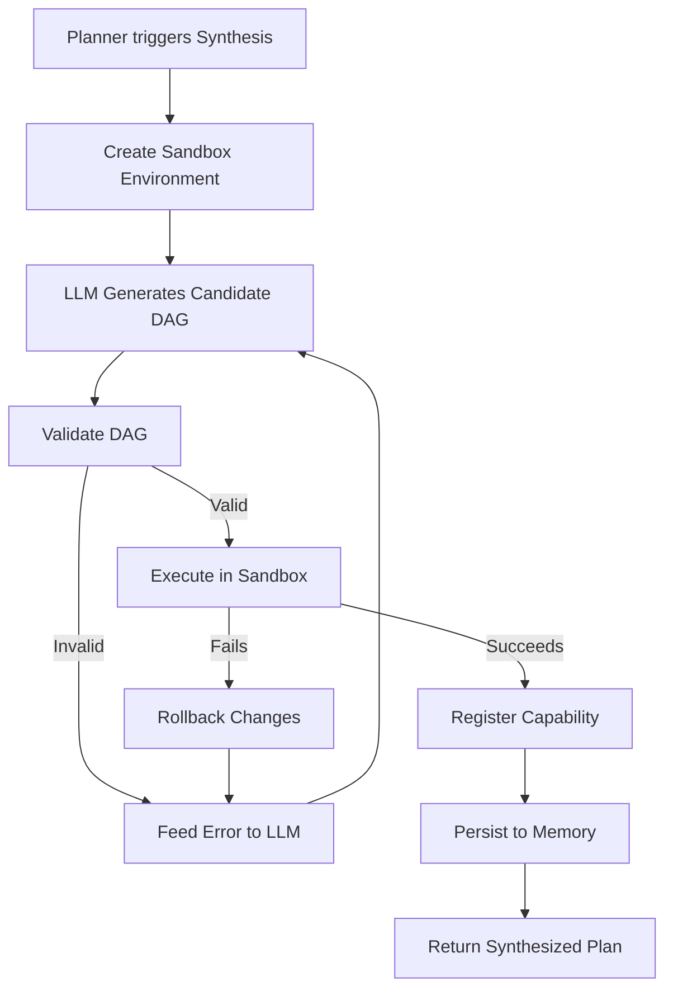

# Capability Synthesis

```mermaid
graph TD
    Start[Planner triggers Synthesis] --> Sandbox[Create Sandbox Environment]
    Sandbox --> LLM[LLM Generates Candidate DAG]
    
    LLM --> Validate[Validate DAG]
    Validate -- Invalid --> Feedback[Feed Error to LLM]
    Feedback --> LLM
    
    Validate -- Valid --> Execute[Execute in Sandbox]
    
    Execute -- Fails --> Rollback[Rollback Changes]
    Rollback --> Feedback
    
    Execute -- Succeeds --> Register[Register Capability]
    Register --> Persist[Persist to Memory]
    Persist --> Return[Return Synthesized Plan]
```
