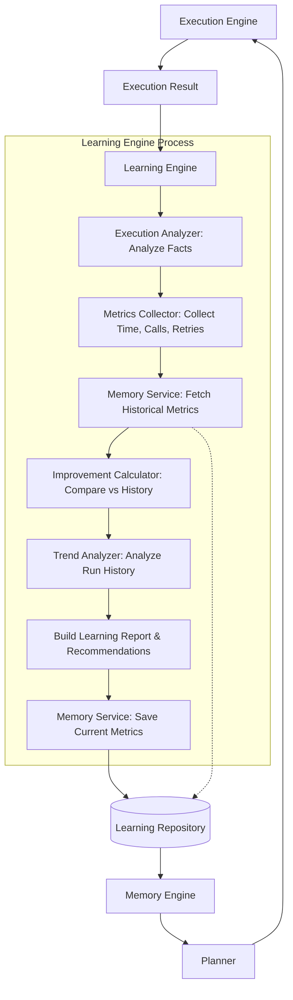

# Learning Loop

```mermaid
graph TD
    Exec[Execution Engine] --> Result[Execution Result]
    Result --> Learn[Learning Engine]
    
    subgraph Learning Engine Process
        Learn --> AnalyzeFacts[Execution Analyzer: Analyze Facts]
        AnalyzeFacts --> ExtractMetrics["Metrics Collector: Collect Time, Calls, Retries"]
        ExtractMetrics --> FetchHistory[Memory Service: Fetch Historical Metrics]
        FetchHistory --> CalcImprovements[Improvement Calculator: Compare vs History]
        CalcImprovements --> AnalyzeTrends[Trend Analyzer: Analyze Run History]
        AnalyzeTrends --> BuildReport[Build Learning Report & Recommendations]
        BuildReport --> SaveMetrics[Memory Service: Save Current Metrics]
    end
    
    SaveMetrics --> DB[(Learning Repository)]
    FetchHistory -.-> DB
    
    DB --> MemEngine[Memory Engine]
    MemEngine --> Planner[Planner]
    Planner --> Exec
```
