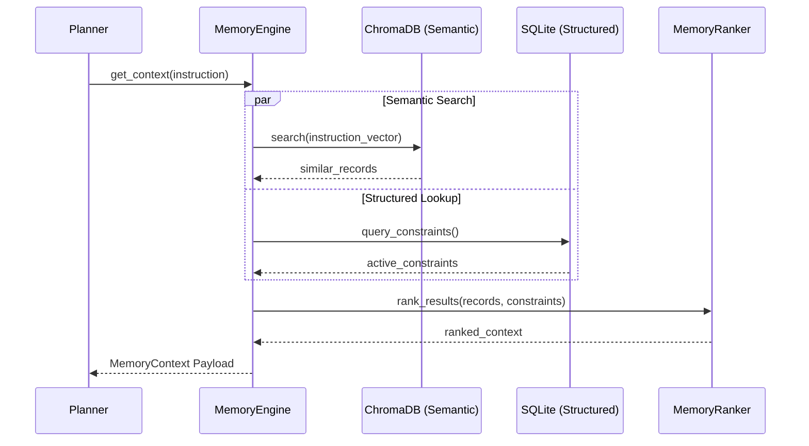

# Memory Flow

```mermaid
sequenceDiagram
    participant Planner
    participant MemEngine as MemoryEngine
    participant Chroma as ChromaDB (Semantic)
    participant SQLite as SQLite (Structured)
    participant Ranker as MemoryRanker
    
    Planner->>MemEngine: get_context(instruction)
    
    par Semantic Search
        MemEngine->>Chroma: search(instruction_vector)
        Chroma-->>MemEngine: similar_records
    and Structured Lookup
        MemEngine->>SQLite: query_constraints()
        SQLite-->>MemEngine: active_constraints
    end
    
    MemEngine->>Ranker: rank_results(records, constraints)
    Ranker-->>MemEngine: ranked_context
    
    MemEngine-->>Planner: MemoryContext Payload
```
