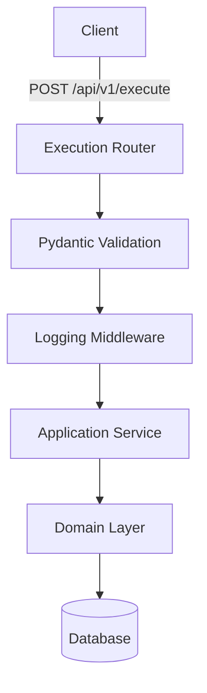

# Api Flow

```mermaid
graph TD
    Client -->|POST /api/v1/execute| Router[Execution Router]
    Router --> Val[Pydantic Validation]
    Val --> Mid[Logging Middleware]
    Mid --> App[Application Service]
    App --> Domain[Domain Layer]
    Domain --> DB[(Database)]
```
