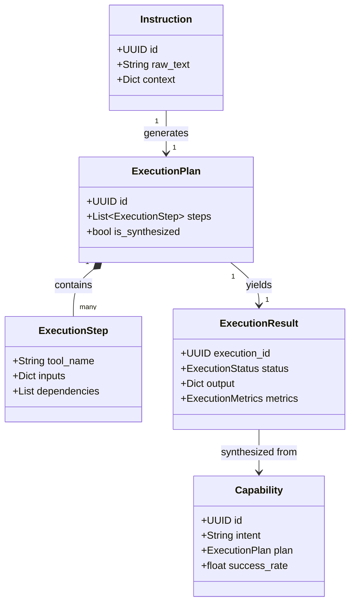

# Class Diagram

```mermaid
classDiagram
    class Instruction {
        +UUID id
        +String raw_text
        +Dict context
    }
    class ExecutionPlan {
        +UUID id
        +List~ExecutionStep~ steps
        +bool is_synthesized
    }
    class ExecutionStep {
        +String tool_name
        +Dict inputs
        +List dependencies
    }
    class ExecutionResult {
        +UUID execution_id
        +ExecutionStatus status
        +Dict output
        +ExecutionMetrics metrics
    }
    class Capability {
        +UUID id
        +String intent
        +ExecutionPlan plan
        +float success_rate
    }
    
    Instruction "1" --> "1" ExecutionPlan : generates
    ExecutionPlan "1" *-- "many" ExecutionStep : contains
    ExecutionPlan "1" --> "1" ExecutionResult : yields
    ExecutionResult --> Capability : synthesized from
```
