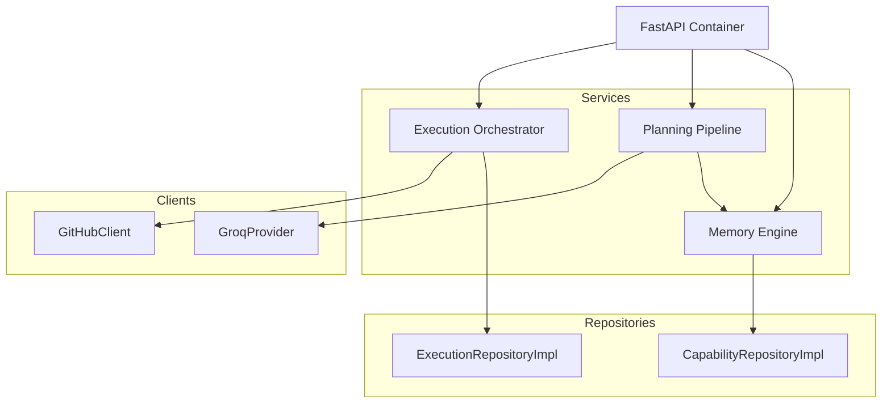

# Component Diagram

```mermaid
graph TD
    API[FastAPI Container]
    
    subgraph Services
        Exec[Execution Orchestrator]
        Plan[Planning Pipeline]
        Mem[Memory Engine]
    end
    
    subgraph Repositories
        ExecRepo[ExecutionRepositoryImpl]
        MemRepo[CapabilityRepositoryImpl]
    end
    
    subgraph Clients
        GH[GitHubClient]
        LLM[GroqProvider]
    end
    
    API --> Exec
    API --> Plan
    API --> Mem
    
    Exec --> GH
    Plan --> LLM
    Plan --> Mem
    
    Mem --> MemRepo
    Exec --> ExecRepo
```
