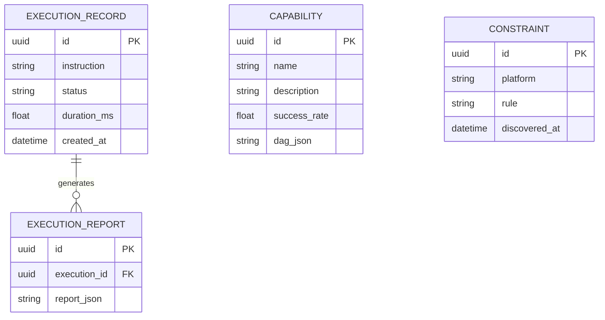

# Database Relationships

```mermaid
erDiagram
    EXECUTION_RECORD {
        uuid id PK
        string instruction
        string status
        float duration_ms
        datetime created_at
    }
    CAPABILITY {
        uuid id PK
        string name
        string description
        float success_rate
        string dag_json
    }
    CONSTRAINT {
        uuid id PK
        string platform
        string rule
        datetime discovered_at
    }
    EXECUTION_REPORT {
        uuid id PK
        uuid execution_id FK
        string report_json
    }
    
    EXECUTION_RECORD ||--o{ EXECUTION_REPORT : generates
```
