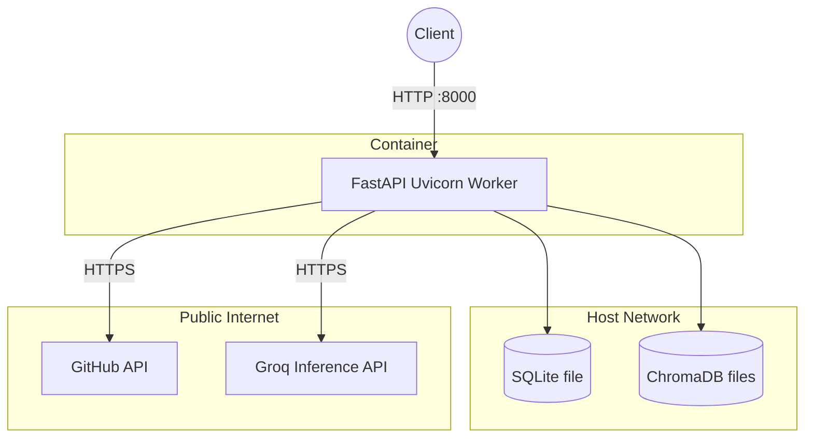

# Deployment

```mermaid
graph TD
    subgraph Container
        App[FastAPI Uvicorn Worker]
    end
    
    subgraph Host Network
        App --> SQLite[(SQLite file)]
        App --> Chroma[(ChromaDB files)]
    end
    
    subgraph Public Internet
        App -- HTTPS --> GHAPI[GitHub API]
        App -- HTTPS --> GroqAPI[Groq Inference API]
    end
    
    Client((Client)) -- HTTP :8000 --> App
```
