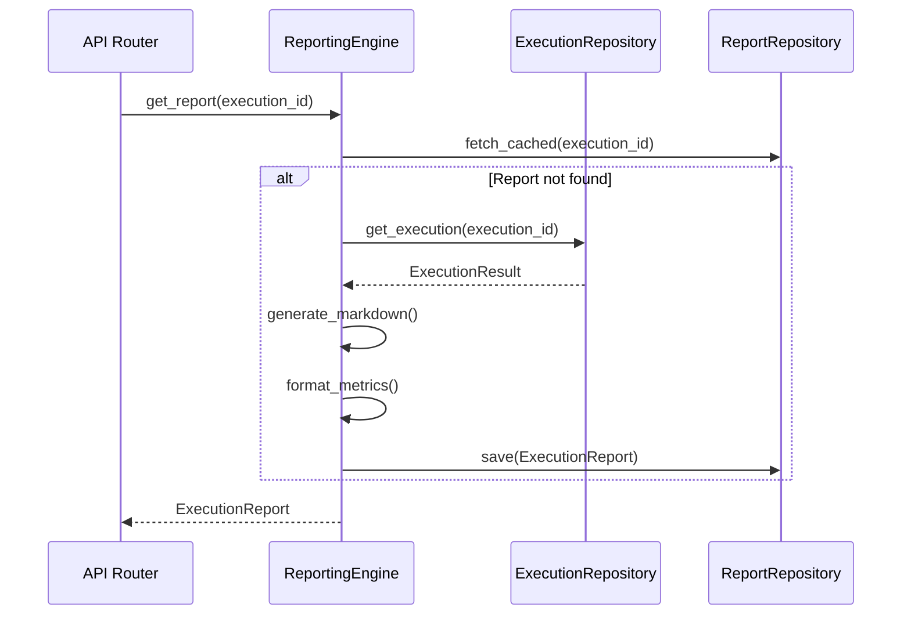

# Execution Report Generation

```mermaid
sequenceDiagram
    participant API as API Router
    participant Reporter as ReportingEngine
    participant ExecStore as ExecutionRepository
    participant ReportStore as ReportRepository
    
    API->>Reporter: get_report(execution_id)
    Reporter->>ReportStore: fetch_cached(execution_id)
    
    alt Report not found
        Reporter->>ExecStore: get_execution(execution_id)
        ExecStore-->>Reporter: ExecutionResult
        
        Reporter->>Reporter: generate_markdown()
        Reporter->>Reporter: format_metrics()
        
        Reporter->>ReportStore: save(ExecutionReport)
    end
    
    Reporter-->>API: ExecutionReport
```
