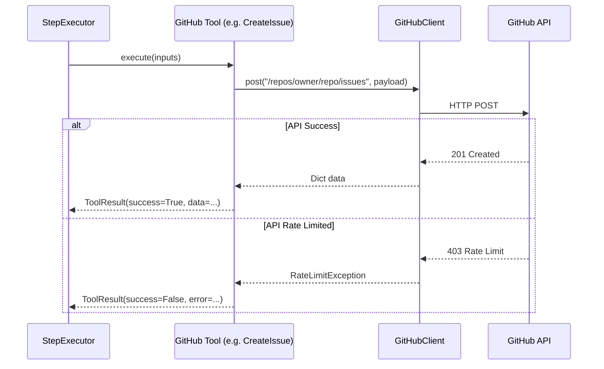

# Github Tool Execution

```mermaid
sequenceDiagram
    participant Executor as StepExecutor
    participant Tool as GitHub Tool (e.g. CreateIssue)
    participant Client as GitHubClient
    participant API as GitHub API
    
    Executor->>Tool: execute(inputs)
    Tool->>Client: post("/repos/owner/repo/issues", payload)
    
    Client->>API: HTTP POST
    
    alt API Success
        API-->>Client: 201 Created
        Client-->>Tool: Dict data
        Tool-->>Executor: ToolResult(success=True, data=...)
    else API Rate Limited
        API-->>Client: 403 Rate Limit
        Client-->>Tool: RateLimitException
        Tool-->>Executor: ToolResult(success=False, error=...)
    end
```
