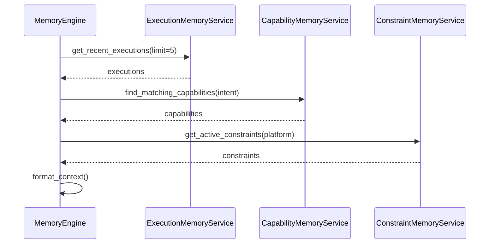

# Memory Retrieval

```mermaid
sequenceDiagram
    participant MemEngine as MemoryEngine
    participant ExecStore as ExecutionMemoryService
    participant CapStore as CapabilityMemoryService
    participant ConStore as ConstraintMemoryService
    
    MemEngine->>ExecStore: get_recent_executions(limit=5)
    ExecStore-->>MemEngine: executions
    
    MemEngine->>CapStore: find_matching_capabilities(intent)
    CapStore-->>MemEngine: capabilities
    
    MemEngine->>ConStore: get_active_constraints(platform)
    ConStore-->>MemEngine: constraints
    
    MemEngine->>MemEngine: format_context()
```
