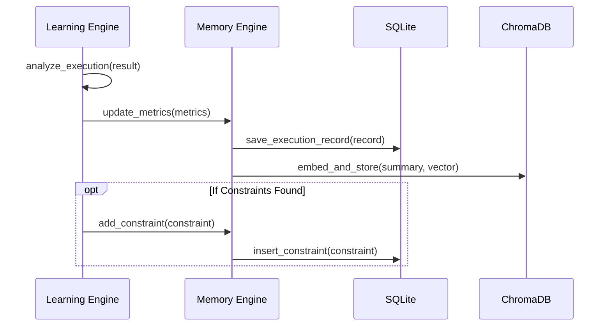

# Memory Update

```mermaid
sequenceDiagram
    participant Learn as Learning Engine
    participant MemEngine as Memory Engine
    participant DB as SQLite
    participant Chroma as ChromaDB
    
    Learn->>Learn: analyze_execution(result)
    Learn->>MemEngine: update_metrics(metrics)
    
    MemEngine->>DB: save_execution_record(record)
    MemEngine->>Chroma: embed_and_store(summary, vector)
    
    opt If Constraints Found
        Learn->>MemEngine: add_constraint(constraint)
        MemEngine->>DB: insert_constraint(constraint)
    end
```
