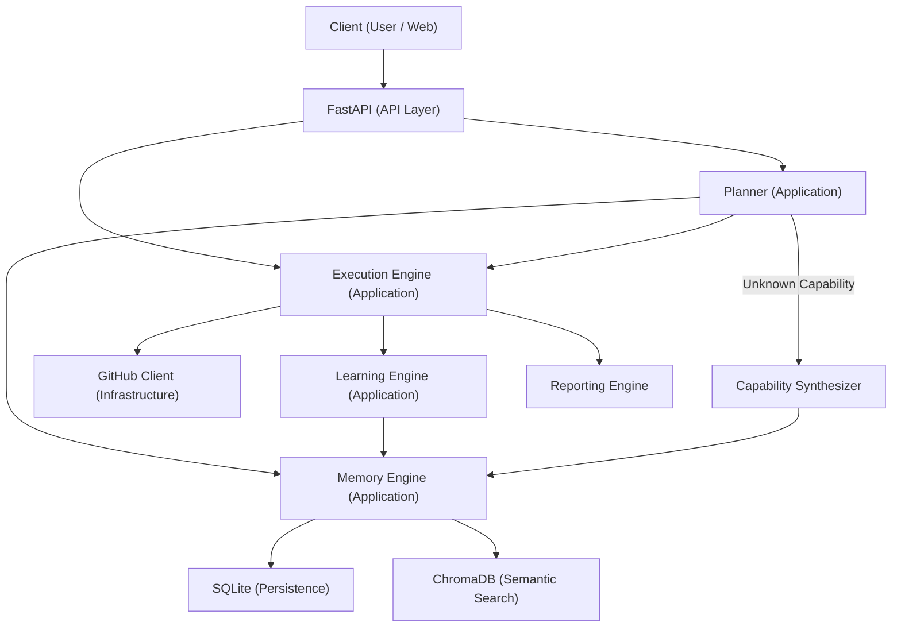

# Overall System

```mermaid
graph TD
    Client["Client (User / Web)"] --> API["FastAPI (API Layer)"]
    API --> Planner["Planner (Application)"]
    API --> Exec["Execution Engine (Application)"]
    
    Planner --> MemEngine["Memory Engine (Application)"]
    Planner --> Exec
    Planner -- "Unknown Capability" --> Synth["Capability Synthesizer"]
    
    Exec --> GH["GitHub Client (Infrastructure)"]
    Exec --> Learn["Learning Engine (Application)"]
    Learn --> MemEngine
    
    MemEngine --> DB["SQLite (Persistence)"]
    MemEngine --> Vector["ChromaDB (Semantic Search)"]
    
    Synth --> MemEngine
    Exec --> Report["Reporting Engine"]
```
