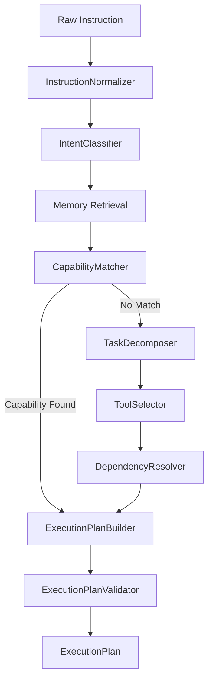

# Planner Flow

```mermaid
graph TD
    Instruction[Raw Instruction] --> Normalizer[InstructionNormalizer]
    Normalizer --> Classifier[IntentClassifier]
    
    Classifier --> MemRetrieve[Memory Retrieval]
    MemRetrieve --> CapMatch[CapabilityMatcher]
    
    CapMatch -- "Capability Found" --> Build[ExecutionPlanBuilder]
    CapMatch -- "No Match" --> Decompose[TaskDecomposer]
    
    Decompose --> ToolSel[ToolSelector]
    ToolSel --> DepRes[DependencyResolver]
    DepRes --> Build
    
    Build --> Validate[ExecutionPlanValidator]
    Validate --> Output[ExecutionPlan]
```
