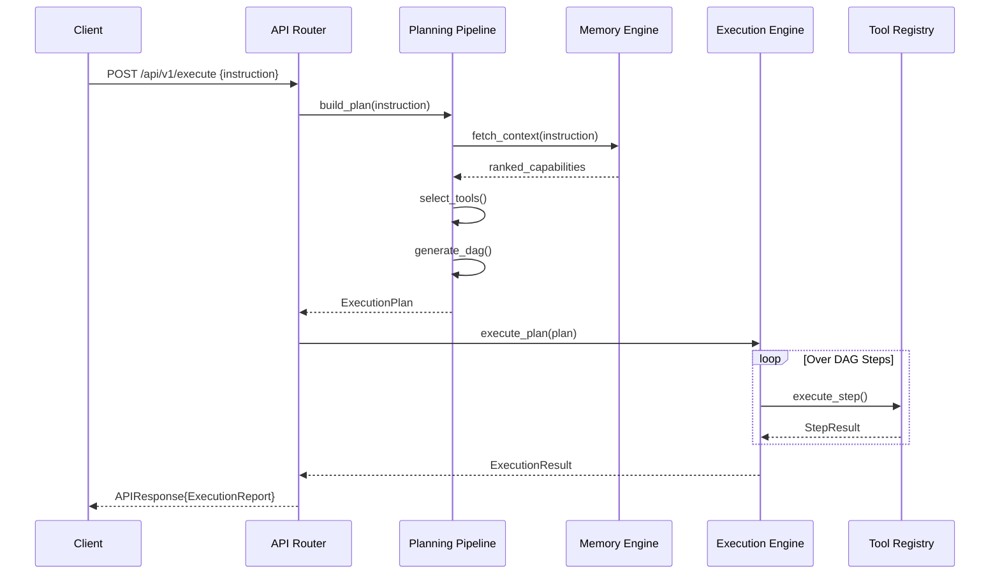

# Request Lifecycle

```mermaid
sequenceDiagram
    participant Client
    participant FastAPI as API Router
    participant Planner as Planning Pipeline
    participant Memory as Memory Engine
    participant Exec as Execution Engine
    participant Tool as Tool Registry
    
    Client->>FastAPI: POST /api/v1/execute {instruction}
    FastAPI->>Planner: build_plan(instruction)
    
    Planner->>Memory: fetch_context(instruction)
    Memory-->>Planner: ranked_capabilities
    
    Planner->>Planner: select_tools()
    Planner->>Planner: generate_dag()
    Planner-->>FastAPI: ExecutionPlan
    
    FastAPI->>Exec: execute_plan(plan)
    
    loop Over DAG Steps
        Exec->>Tool: execute_step()
        Tool-->>Exec: StepResult
    end
    
    Exec-->>FastAPI: ExecutionResult
    FastAPI-->>Client: APIResponse{ExecutionReport}
```
