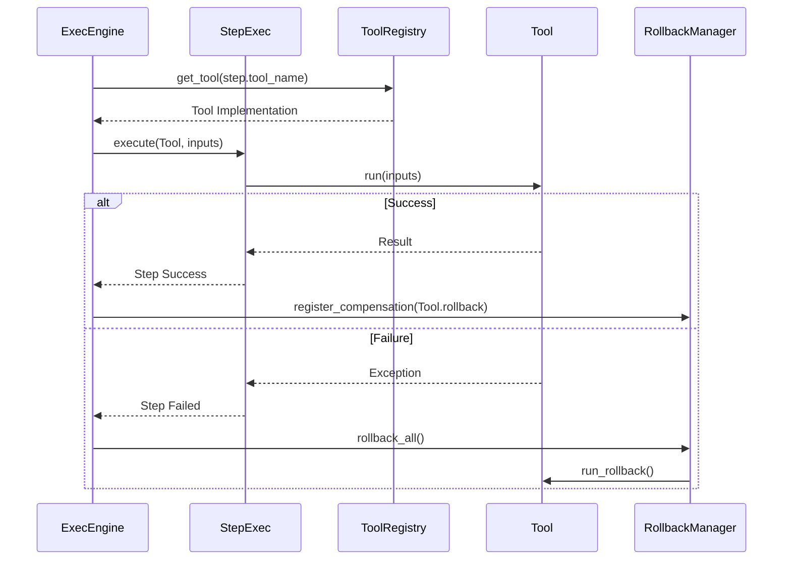

# Sequence Execute

```mermaid
sequenceDiagram
    participant ExecEngine
    participant StepExec
    participant ToolRegistry
    participant Tool
    participant RollbackManager
    
    ExecEngine->>ToolRegistry: get_tool(step.tool_name)
    ToolRegistry-->>ExecEngine: Tool Implementation
    
    ExecEngine->>StepExec: execute(Tool, inputs)
    StepExec->>Tool: run(inputs)
    
    alt Success
        Tool-->>StepExec: Result
        StepExec-->>ExecEngine: Step Success
        ExecEngine->>RollbackManager: register_compensation(Tool.rollback)
    else Failure
        Tool-->>StepExec: Exception
        StepExec-->>ExecEngine: Step Failed
        ExecEngine->>RollbackManager: rollback_all()
        RollbackManager->>Tool: run_rollback()
    end
```
