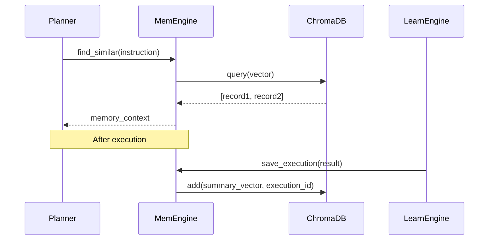

# Sequence Memory

```mermaid
sequenceDiagram
    participant Planner
    participant MemEngine
    participant ChromaDB
    
    Planner->>MemEngine: find_similar(instruction)
    MemEngine->>ChromaDB: query(vector)
    ChromaDB-->>MemEngine: [record1, record2]
    MemEngine-->>Planner: memory_context
    
    Note over Planner, MemEngine: After execution
    
    participant LearnEngine
    LearnEngine->>MemEngine: save_execution(result)
    MemEngine->>ChromaDB: add(summary_vector, execution_id)
```
