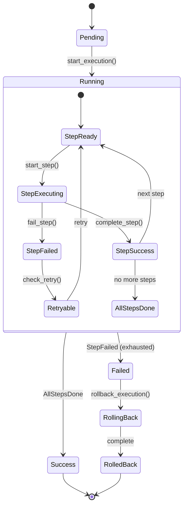

# State Machine

```mermaid
stateDiagram-v2
    [*] --> Pending
    Pending --> Running : start_execution()
    
    state Running {
        [*] --> StepReady
        StepReady --> StepExecuting : start_step()
        StepExecuting --> StepSuccess : complete_step()
        StepExecuting --> StepFailed : fail_step()
        
        StepFailed --> Retryable : check_retry()
        Retryable --> StepReady : retry
        
        StepSuccess --> StepReady : next step
        StepSuccess --> AllStepsDone : no more steps
    }
    
    Running --> Success : AllStepsDone
    Running --> Failed : StepFailed (exhausted)
    Failed --> RollingBack : rollback_execution()
    RollingBack --> RolledBack : complete
    
    Success --> [*]
    RolledBack --> [*]
```
